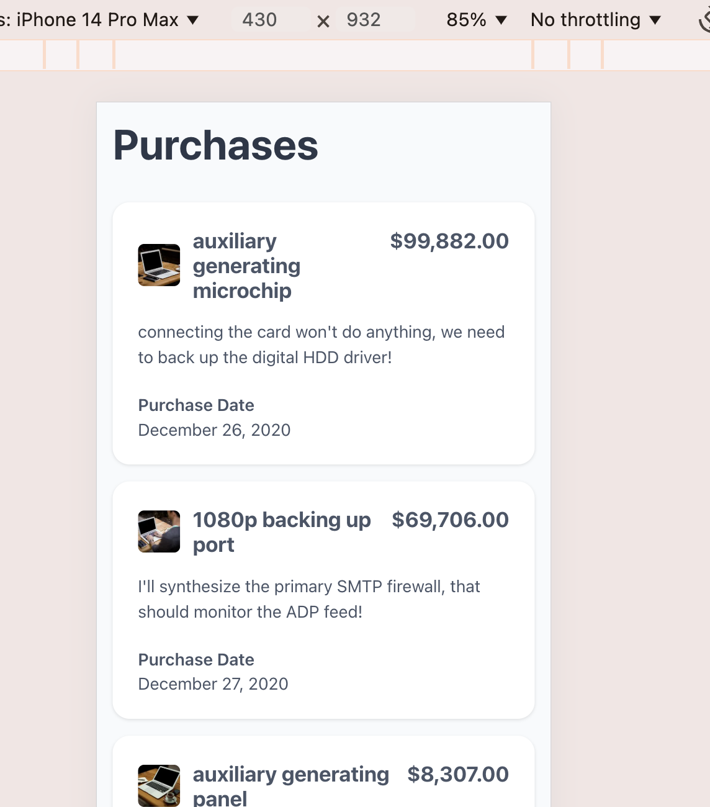
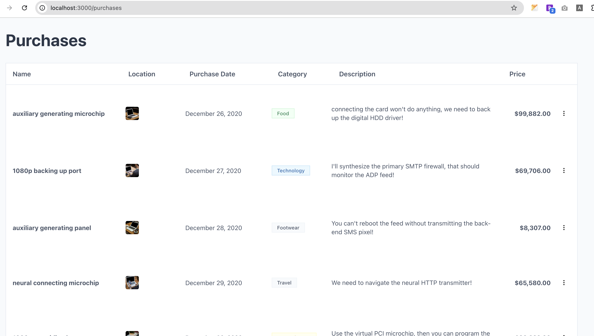
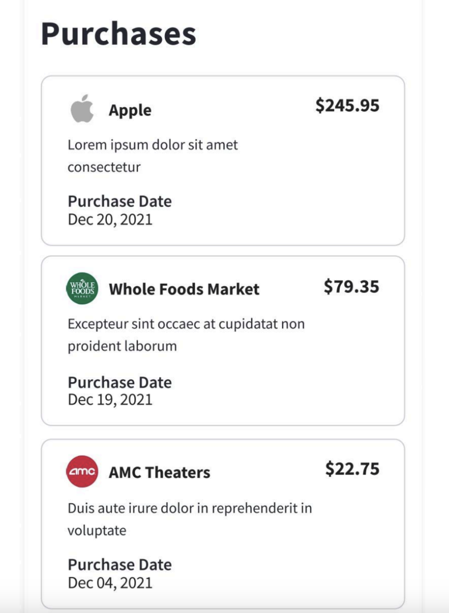
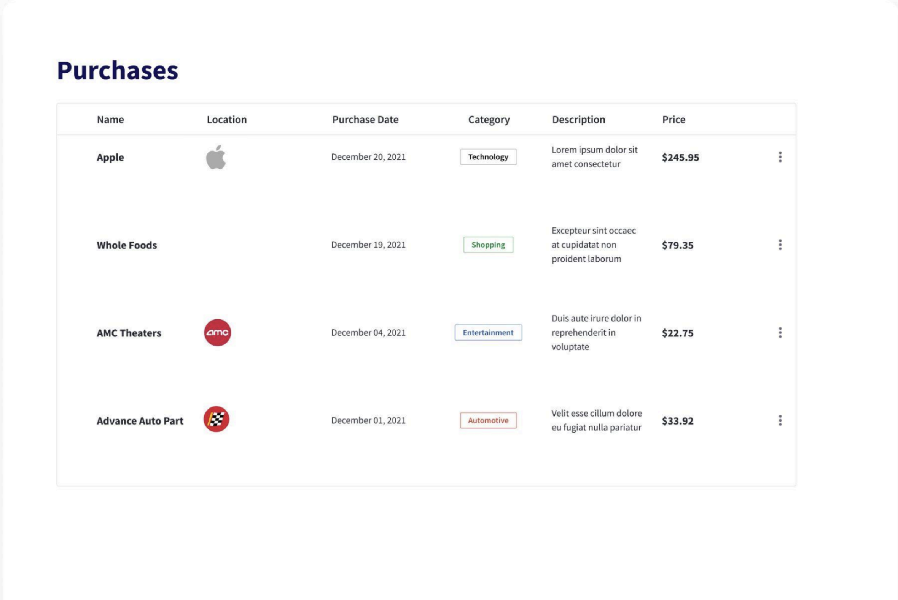
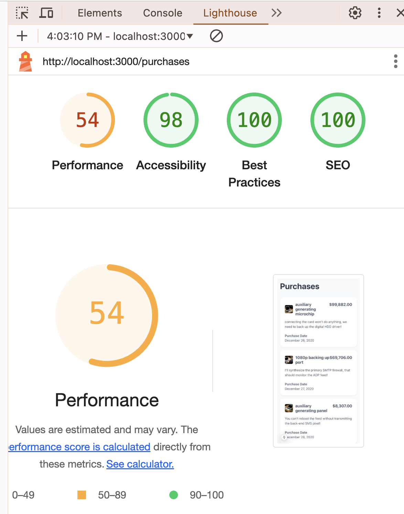

## Getting Started

Note: if you do not have a local development environment readily available to you, this project is also being hosted on Vercel [here for viewing](https://idmeproject-2af6dpfm3-addy5s-projects.vercel.app/purchases).

To deploy locally, ensure you have [node and npm installed](https://docs.npmjs.com/downloading-and-installing-node-js-and-npm) on your local environment.

- Clone this repo to your local directory and cd into the project from your terminal
- Install project dependencies with npm
- Run the development server

```bash
cd ${PATH_TO_DIRECTORY}
npm install
npm run dev
```

Open [http://localhost:3000/purchases](http://localhost:3000/purchases) with your browser to view the app.





## Description
The theme of this project is a basic demo of a "Purchases" page that performs the following:
- Loads an HTML page at route /purchases
- Page should fetch data sourced from the following [API endpoint](https://storage.googleapis.com/marketplace-prod-7728-shop-cdn-e5e2/interview/data.json)
- Data should be rendered in the following responsive layouts:
    - mobile
    
    - desktop
    
- Page should generally be functional and performant, and free of any UX issues


## Author Notes

- The core technologies used in this project includes:
    - [Next.js](https://nextjs.org)
    - [React JS](https://react.dev/)
    - [TypeScript](https://www.typescriptlang.org/)
    - [Sass](https://sass-lang.com/documentation/)

- Due to the target of 3 hours, I chose to bootstrap this project with [Next.js](https://nextjs.org). The benefits of using a framework included: 
    - boilerplate code created on installation
    - built-in optimizations (code splitting, preloading, etc)
    - well documented conventions and standards

In production applications at scale, I would weigh the requirements, resources, and expertise of the team more heavily when choosing a technology stack. For example, I really enjoy using Next JS for personal projects; however, considerations like scalability, performance, costs, and ease of integrations have been deprioritized in favor of getting MVP up and running.

- Improvements if I had more time:
    - Testing - I would have liked to include a minumum of unit tests for the components and any methods containg business logic. And if I had more time, revisit adding UI / functional tests (selenium , Cypress, etc).
    - I would have cleaned up my styling structure a bit more:
        - Create top level files for shared variables like: colors, breakpoints, commonly used mixins
        - Reduce the amount of nested selectors in .scss files. Although semantically correct, I lean towards more human readable/digestible sass rules (max 2 nested levels) are far more beneficial
    - Debug the performance issues reported by Lighthouse
      

